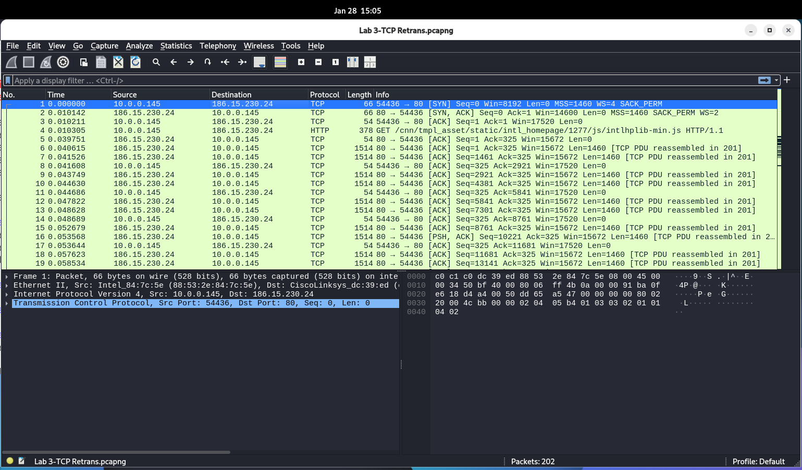
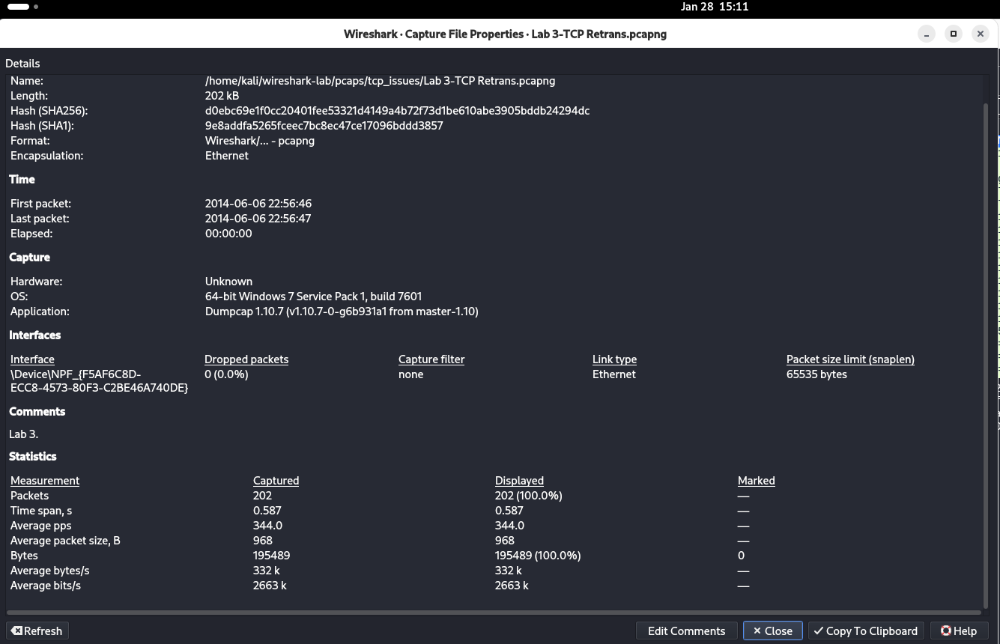
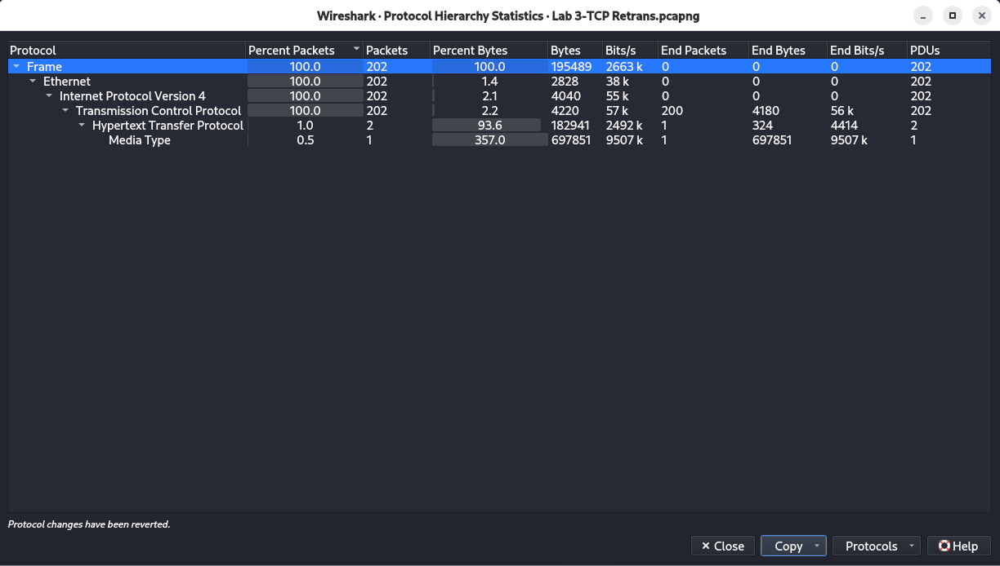
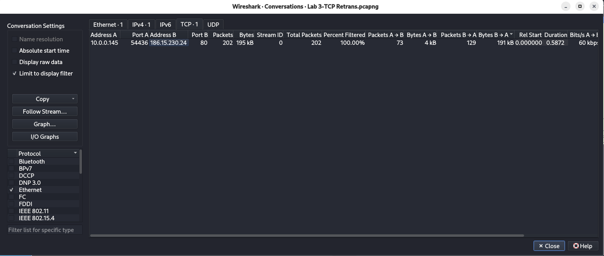
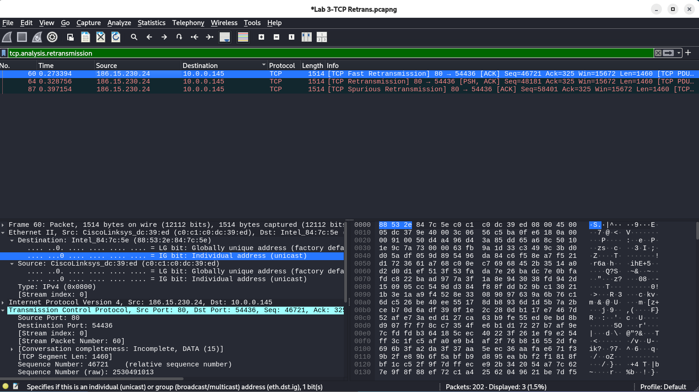
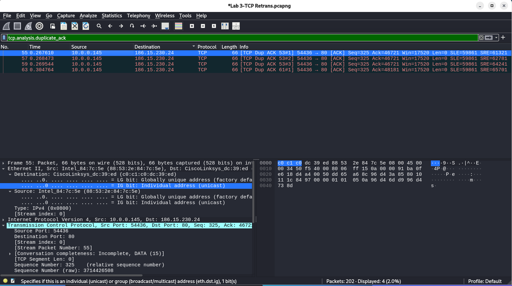
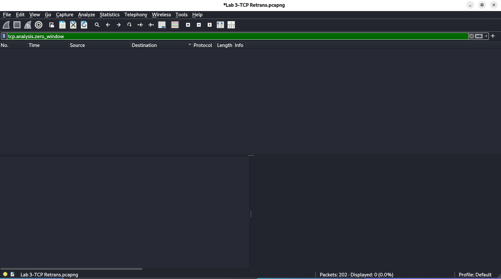
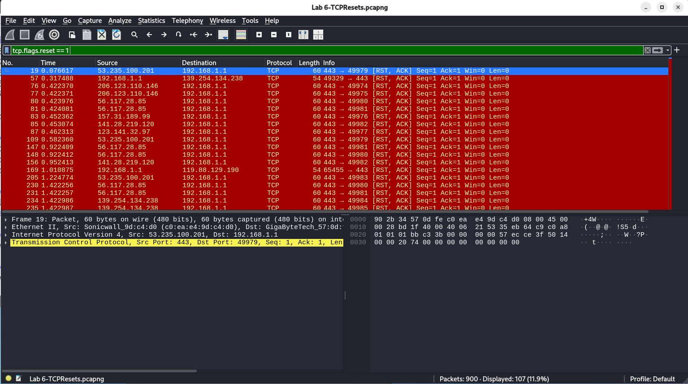
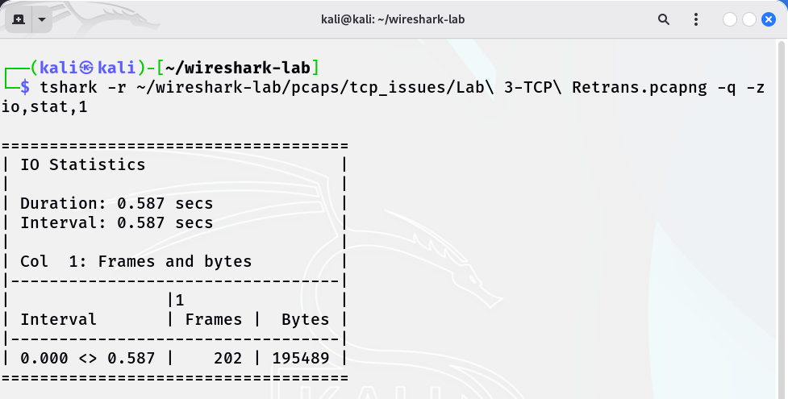

# Wireshark Network Traffic Analysis

## Project Objective
This project demonstrates **enterprise-level network traffic analysis** using Wireshark.  
The focus is on identifying **TCP issues, congestion, retransmissions, zero windows, and connection resets**.  
Highlighting how a security analyst investigates network anomalies.

---

## PCAP Sources
- Original PCAPs were analyzed locally on a **Kali VM**
- Screenshots and notes demonstrate all analysis steps, methodology, and SOC-style observations
- Screenshots show filters, traffic patterns, TCP issues, and CLI validation

---

## Methodology
1. Open PCAPs in Wireshark
2. Analyze **Capture File Properties** (packet count, file size, duration)
3. Analyze **Protocol Hierarchy** to identify dominant protocols
4. Analyze **TCP Conversations** to find high-traffic endpoints
5. Apply **SOC-style filters**:
   - `tcp.analysis.retransmission` — detect packet retransmissions
   - `tcp.analysis.duplicate_ack` — detect congestion events
   - `tcp.analysis.zero_window` — detect flow-control issues
   - `tcp.flags.reset == 1` — detect abrupt connection resets
6. Follow TCP streams to examine **application-layer impact**
7. Validate results using **CLI with tshark** (`-q -z io,stat,1`) to detect traffic spikes

---

## Analysis Example — Lab 3 TCP Retransmissions

**PCAP**: Lab 3-TCP Retrans.pcapng (analyzed locally)

**Total Packets**: 202  
**Protocols**: TCP: 202, UDP: 202, HTTP: 2, Media Type: 1  
**Top Endpoints**: A ↔ B (202 packets)  

---

### Filters & Observations

#### 1. Capture Opened

#### 2. Capture File Properties

#### 3. Protocol Hierarchy

#### 4. TCP Conversations

#### 5. TCP Retransmissions
  
Observation: 3 retransmissions detected, minor packet loss

#### 6. Duplicate ACKs
  
Observation: Confirms TCP congestion events

#### 7. Zero Window
  
Observation: Flow control issue detected (receiver cannot accept more data)

#### 8. Connection Resets (Lab 6)
  
Observation: Abrupt connection terminations observed

#### 9. CLI Traffic Stats
  
Observation: Traffic spikes per second confirm retransmission bursts

---

## Notes
- All analysis performed **locally on Kali VM**
- Screenshots demonstrate **SOC-style workflow**
- Methodology can be applied to **large enterprise traffic captures**  
- Raw PCAPs are not included to keep GitHub lightweight

---

## Next Steps / Future Enhancements
- Follow TCP streams for Lab 3 and other labs to capture application-layer issues
- Analyze additional TCP anomalies (high-volume or attack traffic)
- Automate tshark CLI reporting for all PCAPs
